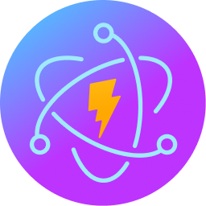

  

      
      <h1 align="center" >Rokon (Roku Remote for your computer) </h1>
  

  

    <b> Control your Roku from your Desktop or Laptop or whatever can output a display. Forget the batteries.</b>
  

> Bootstrapped by Nextron Tailwind template, powered by Electron Builder ❤

This application provides a remote control interface for Roku devices, utilizing React for the frontend.

## Features

- Control your Roku device remotely with a sleek interface.
- Supports various functions such as navigation, volume control, input selection, typing, and so much more.
- **Speed**, go faster than any Roku remote could dream of, all without the noise.
- Purely use your keyboard to control your TV (Neovim Mode)
- Automatic Roku Discovery via [SSDP](https://www.pcmag.com/encyclopedia/term/ssdp) (You can manually input your Roku IP)
- Search your installed Roku apps and channels and quickly launch them. (Roadmap)
- DiscordRPC integration, display what you're doing on your Roku on Discord!
- [ActivityWatch](https://activitywatch.net/) integration
- Option to run on startup and optionally turn on your Roku
- Use open source LLM to convert speech to text for voice control (Roadmap)
- Use your Xbox or PlayStation controller to control your Roku (Roadmap)
- Scripting functionatlity (Roadmap)
- CLI (Roadmap)
- Run actions such as auto scanning at a certain time (Roadmap)
- Webhook support (Roadmap)
- Installing channels (Roadmap)
- Launching things like YouTube with a video (Roadmap)

## Screenshots

Below is an example screenshot of the application:

_(Screenshot taken on March 11, 2024)_

## Installation

To install the app, simply download the appropriate installer for your platform from the [releases page](https://github.com/your-username/your-repo/releases) and follow the installation instructions.

## Usage

Once installed, launch the application, and you'll be greeted with a remote control interface. Use the buttons to control your Roku device.

## Auto-Updating

This app supports auto-updating, ensuring that you always have the latest version with the newest features and bug fixes. It utilizes Electron Builder's built-in auto-update functionality.

[//]: # '## End-to-End Testing'
[//]: #
[//]: # 'To ensure the reliability of the application, it has been extensively tested using end-to-end testing techniques. This ensures that all features work as expected across different platforms and environments.'

## Roku ECP API Integration

The application communicates with Roku devices using the Roku External Control Protocol (ECP) API. This allows for seamless control and interaction with Roku devices.

## Undocumented API Calls

Additionally, the app leverages some undocumented API calls to gain an edge over the competition, providing enhanced functionality and a better user experience.
